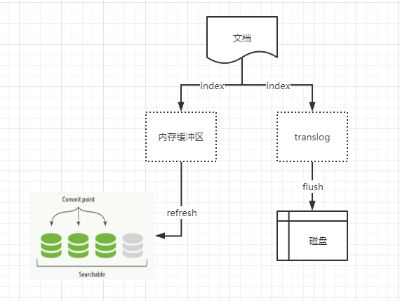

## elasticsearch

*Elasticsearch*是一个基于Lucene的搜索服务器。它提供了一个分布式多用户能力的全文搜索引擎，基于RESTful web接口

### elasticsearch 为什么那么快

- 多节点的集群方案，提高了整个系统的并发处理能力
- 

### 分析器（analyzer）

> 组成：字符过滤器，分词器，token 过滤器
>
> 内置分析器：
>
> - standard
>
>   tokenizer： standard tokenizer
>
>   token filter：standard token filter |  lowercase token filter  | stop token filter
>
> - simple
>
>   tokenizer：lowercase tokenizer
>
> - whitespace
>
>   tokenizer：whitespace tokenizer
>
> - stop
>
>   tokenizer：lower case tokenizer
>
>   token filter： stop token filter
>
> - keyword
>
> - pattern
>
> - language
>
> - fingerprint

#### 字符过滤器(character filters)

> 在传给分词器之前预处理字符流 ：char_filter
>
> 内置的字符过滤器：
>
> - HTML Strip Character Filter:  html_strip
> - Mapping Character Filter：
>
> - Pattern Replace Character Filter
>
>   ```json
>   {
>       "settings":{
>           "analysis":{
>               "analyzer":{
>                   "my_analyzer":{
>                       "tokenizer":"standard",
>                       "char_filter":["my_char_filter"]
>                   }
>               },
>               "char_filter":{
>                   "my_char_filter":{
>                       "type":"pattern_replace",
>                       "pattern":"(\\d+)-(?=\\d)",
>                       "replacement":"$1_"
>                   }
>               }
>           }
>       }
>   }
>   ```
>
>   ```json
>   POST  my_index/_analyze
>   {
>       "analyzer":"my_analyzer",
>       "text":"num is 123-456-789"
>   }
>   
>   terms： [num，is 123_456_789]
>   ```
>
>   

#### 分词器(tokenizer)

> 分词器接收字符流，并将字符流拆分为单个 token,并输出 token 流。例如，一个空格分词器会将文本按照空格拆分。
>
> 基于单词的内置分词器：
>
> - 标准分词器：standard
>
>   根据单词边界将文本拆分，并删除标点符号
>
>   ```json
>   POST _analyze
>   {
>     "tokenizer": "standard",
>     "text": "The 2 QUICK Brown-Foxes jumped over the lazy dog's bone."
>   }
>   
>   terms: [ The, 2, QUICK, Brown, Foxes, jumped, over, the, lazy, dog's, bone ]
>   ```
>
> - 字母分词器：letter
>
>   每当遇到不是字母的字符时，会进行拆分，并删除非字母的字符
>
> - 小写分词器：lowercase
>
>   在字母分词器的基础上，同时将所有字母转为小写
>
> - 空格分词器：whitespace
>
>   每当遇到空格时，会进行拆分
>
> - uax_url_emali 分词器：
>
>   在标准分词器的基础上，会将 url 和 电子邮件保留为单个 token
>
> - 经典分词器：classic
>
>   基于语法的英文分词器
>
> 结构化文本分词器：标识符，电子邮件地址，邮政编码 和路径
>
> - keyword 分词器：keyword
>
>   空分词器，输入和输出相同；可以
>
> - pattern 分词器：pattern
>
> - path 分词器：path_hierarchy

#### token 过滤器(token filters)

> 接收来自于 分词器的 的 token 流，可以修改 token（例如 lowercasing），删除token（移除 停顿词），或者增加 token（例如同义词）。filter
>
> 内置token 过滤器比较多

#### 常用分析器

- ik 分析器

  >  ik_max_word  :尽可能多的返回词语
  >
  >  ik_smart：尽可能少的返回词语
  
- pinyin

### 倒排索引

> 对于索引的字段，倒排索引由文档中所有不重复词的列表构成，对于每个词，有一个包含它的文档列表。
>
> elasticsearch 为每个字段都建立了一个倒排索引。倒排索引有三部分组成：
>
> 
>
> - term index：B树，保存term dictionary 的前缀与 term dictionary block 之间的映射关系，同时使用FST 压缩技术，保存到内存中
>
> - term dictionary：将所有的term排个序，二分 查找 term,logN 的查找效率
>
> - posting list：
>
>   - FOR（Frame Of Reference）编码技术：增量编码压缩，分割成块，按需分配空间；减少磁盘占用空间
>
>     
>
>   - Roaring bitmap：N/65536  N%65536  \<商，余数>表示每组id
>
>     当文档数量少于 4096 时，用 Integer 数组，否则，用 bitmap.
>
>     Lucene 会把从磁盘取出来的数据，通过 Roaring bitmaps 处理后，缓存到内存中，Lucene 称之为 filter cache.
>
> 


### 优化

1. 存储成本

   - 存储选项： 倒排索引（index=false）、行存（_source 中 enable=false）、列存（字段中doc_values=false）
   - text 、keyword 选择

2. 集群稳定性

   - 控制index 的分片数 shard ;  100GB 以下的索引设置3-5个 shard. 单shard 不超过 50GB，

     > 一般节点数=shard分片数性能最优，为了后期增加节点，一般设置 shard > 节点数；比如3节点5shard,后期可可扩容5节点

   - 控制index 的副本数，shard 的副本 replica，分为主从

     > 副本过多，存储成本上升
     >
     > 副本过少，影响查询性能

3. 集群性能

   - 持久化参数：

     > 默认每1秒钟 refresh 一次，产生一个 segment，如果对数据可见性要求不是太高，可以适当调大；
     >
     > 默认 translog 每写一次就刷盘(fsync)一次，可以改成异步刷新
     >
     > merge 策略，底层不断把小的segment合并成大的，默认情况下Es默认配置与节点CPU个数相关，CPU个数越大，占用资源越大，控制一下，避免占用过大资源

   - 写入优化

     > bulk批量写入 ，1000-10000
     >
     > 使用routing，相同的数据写入到同一个分片中，查询时指定routing，只查询指定的那个routing，降低调度开销，提升查询效率
     >
     > 单个index的shard数量：total_shards_per_node：强制限定一个节点上某个index的shard数量，让 shard数量分配到不同节点上，避免集群中出现过热节点，影响写入/查询性能
     >
     > 综合考虑整个index的shard数量，如果shard数量(不包括副本)超过50个，就很可能引发写入/查询缓慢的问题。可考虑把index 拆分为多个独立的index，分摊数据量

   - 查询优化

     > 使用 query-bool-filter ：非全文索引，精确查找目标数据 ；不计算score，缓存filter的结果集，加速后续查询
   
   ** 设计优化，写入优化，

### 集群

> 索引是指向一个或者多个物理分片的逻辑命名空间。
>
> 一个分片是一个底层的工作单元，一个分片是一个 Lucene的实例，一个分片本身就是一个完整的搜索引擎。
>
> 一个 lucene 索引在 elasticsearch 中称作 分片；一个 elasticsearch 索引是分片的集合。当 elasticsearch 在索引中搜索的时候，他发送查询到每一个属于索引的分片（Lucene 索引），然后像执行分布式检索那样，合并每个分片的结果到一个全局的结果集。一个 Lucene 索引包含一个提交点和若干个段，每一段本身都是一个倒排索引
>
> > *动态更新索引*
> >
> > 逐段搜索会按如下流程工作：
> >
> > - 新文档被收集到内存索引缓存；
> > - 不时地，缓存被提交：
> >   - 一个新的段（一个追加的倒排索引）被写入磁盘  ，
> >   - 一个新的包含新段名字的提交点被写入到磁盘
> >   - 磁盘进行同步（所有在文件系统缓存中等待的写入都刷新到磁盘，以确保它们被写入到物理文件）
> > - 新的段被开启，让它包含的文档可以搜索
> > - 内存缓存被清空，等待接收新的文档
> >
> > 删除和更新
> >
> > 段是不可改变的，所以既不能删除也不能修改。取而代之的是，每个提交点会包含一个 .del 文件，文件中会列出这些被删除文档的段信息。当一个文档被删除，它实际上只是在 .del 文件中被标记删除，一个被标记删除的文档仍然可以被查询匹配到，但它会在最终结果被返回前从结果集中移除。
> >
> > *近实时搜索*
> >
> > 上述的按段搜索，一个新的文档从索引到可被搜索的延迟显著降低。但是还不够快，磁盘成为了瓶颈，提交一个段到磁盘需要一个 fsync 来确保段被物理性地写入磁盘，这样再断电的时候就不会丢失数据。但 fsync 代价比较大，如果每次索引一个文档都需要执行 fsync，会造成性能问题。
> >
> > elasticsearch 和 磁盘之间是 文件系统缓存，由之前的，
> >
> > 内存缓冲区→新的段→磁盘 
> >
> > 转变为 
> >
> > **内存缓冲区→新的段→文件系统缓存→磁盘**
> >
> > lucene 允许新段被写入和打开，使其包含的文档在未进行一次完整提交时便对搜索可见。在 elasticsearch 中，写入和打开一个新段的轻量的过程叫做 refresh。默认情况下每个分片会每秒自动刷新一次，实现了近实时搜索。
> >
> > **持久化变更**
> >
> > 
> >
> > 为了保证持久化变更，elasticsearch 增加了 translog,或者叫事务日志，在每一次对 elasticsearch进行操作时均进行了记录：
> >
> > - 一个文档被索引之后，就会添加到内存缓冲区（memory buffer），并且追加到 translog
> > - 每一秒的刷新（refresh）使内存缓存清空，而 translog 不会清空：
> >   - 这些在内存缓冲区的文档被写入到一个新的段（segment）中，且没有进行 fsync 操作
> >   - 这个段被打开，使其可被搜索
> >   - 内存缓冲区被清空
> > - 这个进程继续工作，更多的文档被添加到内存缓冲区和追加到 事务日志
> > - 每隔一段时间（例如 translog 变得越来越大、时间满足30分钟）一个新的 translog 被创建，并且一个全量提交被执行：
> >   - 所有的内存缓冲区的 文档都被写入到一个新的段中
> >   - 缓冲区被清空
> >   - 一个提交点被写入到硬盘
> >   - 文件系统缓存通过 fsync 被刷新（flush）
> >   - 老的 translog 被删除
> >
> > translog 提供所有还没有被刷到磁盘的操作的一个持久化记录。当 elasticsearch 启动的时候，它会从磁盘中使用最后一个提交点去恢复已知的段，并且会重放 translog 中所有在最后一次提交后发生的变更操作。
> >
> > translog 也被用来提供实时 CRUD 。当你试着通过 ID 查询、更新、删除一个文档，它会在尝试从相应的段中检索之前，首先检查 translog 任何最近的变更。这意味着它总是能够实时地获取到文档的最新版本。
> >
> > 执行一个提交并且截断 translog 的行为在 elasticsearch 被称作 一次 flush。分片每30分钟自动刷新（flush）,或者 translog 太大的话也会刷新。
> >
> > 文件被 fsync 到 磁盘 之前，被写入的文件在重启后会丢失。默认 
> >
> > - translog 每 5秒被 fsync 刷新到磁盘，
> > - 或者在每次写请求（index,delete,update,bulk）完成之后执行
> >
> > 上述过程在主分片和副分片都会发生。意味着，整个请求被 fsync 到主分片和副本分片的 translog 之前，你的客户端不会得到一个 200 ok 响应。
> >
> > **段合并**
> >
> > 每一个段都会消耗文件句柄 、内存 和  cpu 运行周期；每个搜索请求都必须轮流检查每个段，所以段越多，搜索也越慢。
> >
> > elasticsearch 在后台进行段合并来解决以上问题：
> >
> > - 当索引刷新的时候，刷新（refresh）操作会创建新的段并将段打开以供搜索使用
> > - 合并进程选择一小部分大小相似的段，并且在后台将它们合并到更大的段中。这并不会中断索引和搜索
> > - 一旦合并结束，老的段被删除
> >   - 新的段被刷新（flush）到了磁盘，写入一个包含新段且排除旧的和较小的段的新提交点
> >   - 新的段被打开用来搜索
> >   - 老的段被删除
> >
> > _optimize  api 可看做是 强制合并 api.
>
> 一个运行中的 Elasticsearch 实例称为一个节点，而集群是由一个或者多个拥有相同 cluster.name 配置的节点组成。集群会平均分布所有的数据。当一个节点被选举为主节点时，它将负责管理集群范围内的所有变更，如索引的增删，节点的增删；不涉及文档级别的变更和搜索。
>
> 所有新近被索引的文档都会保存在主分片上，然后被并行的复制到对应的副本上。
>
> es 使用乐观锁进行并发控制； PUT   /website/blog/1?version=1 ; 若失败则返回 409

#### 路由一个文档到一个分片中

> 路由公式：shard = hash(routing) % number_of_primary_shards
>
> > routing 是一个可变值，默认是文档的id，也可以设置成一个自定义的值

#### 主分片和副分片的交互

> 协调节点通过轮询所有的分片拷贝来分摊负载。
>
> - ##### 新建、索引 或者删除文档
>
>   
>
>   > 客户端向 协调节点发送新建、索引或者删除请求
>   >
>   > 协调节点对文档进行路由，将请求转发到 对应分片的主分片所在节点上
>   >
>   > 在主分片上执行请求。如果成功，将请求并发转发到 其他节点的所有副本分片上。一旦所有副本分片都报告成功（满足一定条件，由consistency设置），该主分片 将向协调节点 报告成功，协调节点向客户端报告成功
>   >
>   > consistency :
>   >
>   > - one：主分片状态ok 就允许执行 写操作
>   > - all ：主分片 和所有的副本分片的状态没问题才允许执行写操作
>   > - quorum：默认值，int((primary +  number_of_replicas)/2) + 1 ；number_of_replicas 大于1的时候规定数量才会才会执行
>
> - ##### 取回一个文档
>
>   
>
>   > 客户端向协调节点 发送请求
>   >
>   > 协调节点对文档进行路由确定分片，根据负载均衡，将请求转发到 对应节点;
>   >
>   > 对应节点将文档返回给 协调节点, 协调节点 返回给客户端；
>   >
>   > 协调节点在每次请求的时候都会通过轮询所有副本分片来达到负载均衡
>
> - ##### mget 取回多个文档
>
>   > 客户端向 node1 发送 mget 请求
>   >
>   > node1 为每个分片构建多文档获取请求，然后并行转发这些请求到托管在每个所需的主分片或者副本分片的节点上。一旦受到所有答复，node1构建响应并返回给客户端
>
> - ##### bulk 修改多个文档
>
>   
>
>   > 客户端向协调节点 node1 发送 bulk 请求
>   >
>   > 协调节点node1 为每个节点创建一个批量请求，并将这些请求并行转发到每个包含主分片的节点主机
>   >
>   > 主分片一个接一个按顺序执行每个操作。当每个操作成功时，主分片并行转发新文档（或删除）到副本分片，然后执行下一个操作。一旦所有的副本分片报告所有操作成功，该节点将向协调节点报告成功，协调节点将这些响应收集整理并返回给客户端。
>
> - 执行分布式索引  query then fetch
>
>   
>   
>   - 查询阶段
>   
>     
>
>  在初始查询阶段，查询会广播到索引中每一个分片拷贝（主分片 或者 副本分片）。每个分片在本地执行搜索并构建一个匹配文档的优先级队列。
>
> > 客户端发送一个 search 请求到协调节点 node3，协调节点 node3 会创建一个大小为 from + size 的空优先队列；
>    >
> > 协调请求 node3 将查询请求转发到索引的每个主分片或者副本分片中，每个分片在本地执行查询添加结果到大小为 from + size 的本地有序优先队列中；
>    >
> > 每个分片返回各自优先队列中所有文档的id 和 排序值给协调节点,协调节点 node3 合并这些值到自己的优先队列中来产生一个全局排序后的结果列表
>
>   - 取回阶段
>
>     > 协调节点辨别出哪些文档需要被取回并向相关的分片提交多个 GET 请求；
>     >
>     > 每个分片加载并丰富文档，如果有需要的话，接着返回文档给协调节点
>     >
>     > 一旦所有的文档都被取回，协调节点返回结果给客户端
>  >

#### 节点发现 discovery

##### 发现类型

- multicast ：多播
- unicast：单播

##### 节点

默认，所有节点既可以作为 master 节点， 也可以作为 data 节点。

配置 master 节点 和 data 节点

```yml
# default
node.master:true
node.data:true
# data node：不可以选举为 master 节点
node.master:false
node.data:true
# master node
node.master:true
node.data:false
```

##### 脑裂 split-brain

网络出现问题，其中一部分节点和其他节点请求断开，但是断开的这些请求彼此之前还能继续通信，这些断开的节点重新选举了一个新的 master 节点，这样就造成了拥有相同 cluster.name 的节点 形成了两个集群。

> 如何避免

```
#yml 如下配置
discovery.zen.minimum_master_nodes:n/2 + 1
```


### 常用配置

```proper
spring.elasticsearch.jest.uris
spring.elasticsearch.jest.read-timeout
```


### 和 ES 交互

1. es 内置的2个客户端

- 节点客户端（node client）：加入集群，本身不保存数据
- 传输客户端（transport client）：本身不加入集群

以上两个客户端均通过 9300端口并使用 es 原生传输协议和集群交互，集群中的节点通过9300彼此通信；

2. 通过 9200端口 使用 RESTful api  和  es 进行通信；


 