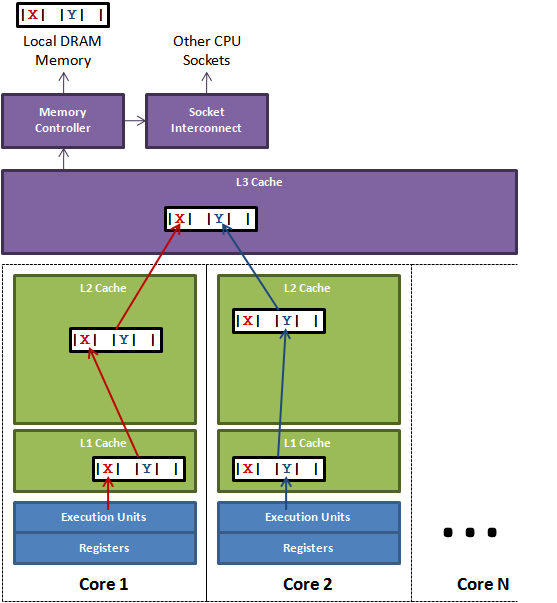

## JAVA

### Java 内存模型（JMM）

JMM 是一种规范，规范了 Java 虚拟机 与 计算机内存是如何协同工作的。一个线程对共享变量的写入何时对另一个线程可见。

首先说下 Java 内存划分

- 线程共享数据区

  > 1. 方法区
  >
  >    > 存储已被虚拟机加载的**类型信息、常量、静态变量、即时编译器编译后的代码缓存**
  >    >
  >    > **运行时常量池**：方法区的一部分；class 文件中除了有类的版本、字段、方法、接口等描述信息外，还有一项信息是常量池表，用于存储编译期生成的各种字面量与符号引用，这部分加载后存放到运行时常量池。
  >
  > 2. Java 堆  
  >
  >    > 存放对象实例
  >    >
  >    > 新生代：eden区，两个 survivor 区：S0,S1; 默认比例 8:1:1 ，默认年龄达到15 或者 同一个年龄的数量超过 survivor 区一半时也会进行回收；正常对象先放入新生代的 egen 区，如果创建的对象太大，eden 放不下，则会直接放到老年代
  >    >
  >    > 老年代：

- 线程隔离数据区

  > 1. 程序计数器
  >
  > 2. Java虚拟机栈  stack
  >
  >    > 每个方法被执行的时候，Java 虚拟机都会同步创建一个栈帧用于存储 **局部变量表**，**操作数栈**，**动态链接**，**方法出口**。每个方法被调用直至执行完毕的过程，就对应着一个栈帧在虚拟机栈中从**入栈到出栈**的过程
  >    >
  >    > 局部变量表：存放 编译期可知的 Java 虚拟机**基本数据类型**、**对象引用** 和  **returnAddress 类型**；其中 double、long 占 2 个 slot ，其余均占 1个 slot。局部变量表所需的内存空间在编译期间完成分配。
  >    >
  >    > 这个内存区域规定了两类异常状况：
  >    >
  >    > - 如果线程请求的栈深度大于虚拟机所允许的深度，将抛出 **StackOverflowError** 异常
  >    > - 如果 Java 虚拟机栈容量可以动态扩展，当栈扩展时无法申请到足够的内存会抛出 **OutofMemoryError**异常（Hotspot 虚拟机不支持动态扩展）
  >
  > 3. 本地方法栈
  >
  >    > 为虚拟机使用到的本地方法服务

每个线程都会有自己的工作内存，是线程私有的；另外 JMM 规定 所有的变量都存储到主内存中。工作内存中的变量是 主内存中变量的拷贝，操作完之后会写回到主内存，不能直接操作主内存。这样在多线程的情况下就会造成线程不安全的问题。JMM 是围绕 程序执行的 原子性、有序性、可见性展开的。

Java 提供了 Sychronized 关键字 或者 ReentrantLock 保证程序执行的原子性；

可见性问题可以通过 Sychronized 或者 volatile 关键字解决；

volatile 可以保证原子性，以及禁止指令的重排序；

另外 JMM 内部还定义了一套 happens-before 原则来保证多线程环境下两个操作间的可见性、有序性。

#### 伪共享

由于 CPU 执行速度很快， 而 内存执行速度很慢，为了提高 CPU 的读写速度，提高系统工作速度，在内存和CPU之间增加了高速缓存(cache)，一般是集成到 CPU 中，也叫 CPU cache，用于协调 CPU 与内存之间的速度差异。通常情况下，当一个 CPU 需要读取主存时，会将主存的部分数据读取到 CPU 高速缓存中	，甚至读取到 CPU 的内部寄存器中。 当 CPU 需要将结果写回到主内存时，会将内部寄存器的值刷新到高速缓存中，然后刷新到主内存。

Cache 内部是按行存储的，其中每一行称为一个 缓存行（Cache line），Cache 行是 Cache 与主内存进行数据交换的单位，Cache 行的大小一般为2 的幂次数字节，一般为32-256个字节，最常见的是 64个字节。

当CPU访问某一个变量时，首先会看 CPU Cache 内是否有该变量，如果有则直接从中获取，否则就去主内存里面获取变量，然后把该变量所在的内存区域的一个 Cache 行大小的内存拷贝到 Cache。当多线程修改互相独立的变量时，如果这些变量共享同一个缓存行，就会无意中影响彼此的性能，这就是伪共享。

在核心1上运行的线程想更新变量 X，同时核心2上运行的线程想更新变量 Y。不幸的是，这两个变量在同一个缓存行中，每个线程都要去竞争缓存行的所有权来更新变量。如果核心1获得了所有权，缓存子系统将会使核心2中对应的缓存行失效。当核心2获得了所有权然后执行更新操作，核心1就要使自己对应的缓存失效。这会来来回回的经过 L3 缓存，大大影响了性能。

解决

1. 手动填充

2. 使用 注解 @sun.misc.Contended ， 并在启动时添加参数  -XX:-RestrictContended

### IO

- BIO：同步阻塞 IO

  面向流，socket 的 accept 、read、write 等都是同步阻塞的，如果需要同时处理多个客户端，就需要开启多个线程

### NIO

NIO：同步非阻塞 IO

支持面向缓冲的、基于通道的 IO 操作方法。数据总是从通道读取到缓冲区中，或者从缓冲区写入到通道中。

核心api：Channel、Buffer、Selector

#### Channel

- FileChannel：从文件中读取数据
- DataGramChannel：从UDP网络中读取或者写入数据
- SocketChannel：从TCP网络中读取或者写入数据
- ServerSocketChannel：允许你监听来自TCP的连接，就像服务器一样。每一个连接都会有一个SocketChannel产生。

#### Buffer

Java NIO 中的 Buffer 用于 和 NIO 通道进行交互。数据是从通道读入缓冲区，从缓冲区写入到通道中。

使用Buffer 读写数据一般遵循以下步骤

1. 写入数据到 Buffer
2. 调用 flip() 方法
3. 从 Buffer 中读取数据
4. 调用 clear() 方法 或者 compact() 方法

ByteBuffer：字节缓冲区

CharBuffer：字符缓冲区

ShortBuffer：

IntBuffer

LongBuffer：

FloatBuffer：

DoubleBuffer

#### Selector

多路复用的 selector,selector选择器可以监听多个Channel通道感兴趣的事情(read、write、accept(服务端接收)、connect，实现一个线程管理多个Channel，节省线程切换上下文的资源消耗。Selector只能管理非阻塞的通道，FileChannel是阻塞的，无法管理。

零拷贝

| I/O方式             | 系统调用   | CPU拷贝次数 | DMA拷贝次数 | 上下文切换次数 |
| ------------------- | ---------- | ----------- | ----------- | -------------- |
| 传统I/O             | Read/Write | 2           | 2           | 4              |
| 内存映射            | Mmap/write | 1           | 2           | 4              |
| sendfile            | sendfile   | 1           | 2           | 2              |
| sendfile+DMA gather | sendfile   | 0           | 2           | 2              |
| splice              | splice     | 0           | 2           | 2              |
| tee                 | tee        | 0           | 2           | 2              |

DMA：direct memory acess，直接存储器访问

