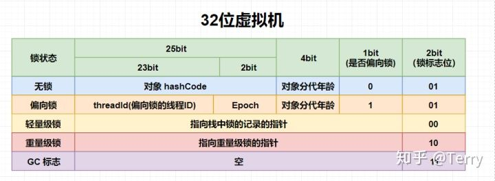

## Java 代码如何运行

### 虚拟机如何运行 Java 字节码

#### 虚拟机角度

**Java 代码** 编译成 **Class 文件** ，并加载到 **Java 虚拟机**，加载后的 Java 类会被存放于**方法区**中。

运行过程中，每当调用一个 java 方法，Java 虚拟机会在当前线程的 **Java 方法栈中生成一个栈帧**，用以存储局部变量以及字节码的操作数，这个栈帧是提前计算好的，而且不要求栈帧在内存空间连续分布。当退出当前执行的方法时，Java 虚拟机会**弹出当前线程的当前栈帧**，并舍弃。

#### 硬件角度

Java 字节码 无法直接运行， 需要翻译成机器码。

翻译过程的两种形式：

1. 解释执行：逐条将字节码翻译成机器码，并执行 ；
2. 即时编译（JIT）：将方法中的包含的所有字节码编译成机器码后  再执行；

Hotspot 默认采用混合模式，综合了两者的优点：会先解释执行字节码，而后将其中反复执行的热点代码，以方法为单位进行即时编译。Hotspt 内置了多个即时编译器，C1，C2; C1  叫做 Client 编译器，面向的是对启动性能有要求的客户端 GUI 程序，采用的优化手段相对简单，因此编译时间较短。C2 又叫做 Server 编译器，面向的是对峰值性能有要求的服务器端程序，采用的优化手段相对复杂，因此编译时间较长，但同时生成代码的执行效率较高。从 Java 7 开始，HotSpot 默认采用分层编译的方式：热点方法首先会被 C1 编译，而后热点方法中的热点会进一步被 C2 编译。

## Java 基本数据类型

### Java 基本类型

### Java 基本类型的大小

#### 栈中局部变量

栈帧有两个主要组成部分：局部变量区 、字节码的操作数栈；

**局部变量区**：除了普遍意义下的局部变量、还包含实例方法的 this 指针、方法接收的参数；局部变量区等价于一个数组，除了**long**  **double**  值需要**两个数组单元**来存储（两个slot），其他**基本类型以及引用类型**的值均占用一个数组单元。即，**boolean、byte、char、short 这四种类型 和 int、float、引用类型**在栈上占有的空间是一样的。因此，在32位的HotSpot 中，这些类型占 4个字节；在64位的 HotSpot 中，占 8个字节；

**操作数栈**：Java 虚拟机的算数运算几乎全部依赖于操作数栈。也就是说，我们需要将堆中的 boolean、byte、char 以及 short 加载到操作数栈上，而后将栈上的值当成 int 类型来运算。对于 boolean、char 这两个无符号类型来说，加载伴随着零扩展。对于 byte、short 这两个类型来说，加载伴随着符号扩展。

boolean 字段和 boolean 数组则比较特殊。在 HotSpot 中，boolean 字段占用一字节，而 boolean 数组则直接用 byte 数组来实现。为了保证堆中的 boolean 值是合法的，HotSpot 在存储时显式地进行掩码操作，也就是说，只取最后一位的值存入 boolean 字段或数组中。

| 类型     | 是否有符号 | 栈中占用空间   |      | 堆中占用空间 |
| -------- | ---------- | -------------- | ---- | ------------ |
| boolean  | 无         | 4字节 \| 8字节 |      | 1字节        |
| byte     | 有         | 4字节 \| 8字节 |      | 1字节        |
| short    | 有         | 4字节 \| 8字节 |      | 2字节16位    |
| char     | 无         | 4字节 \| 8字节 |      | 2字节16位    |
| int      | 有         | 4字节 \| 8字节 |      | 4字节        |
| float    | 有         | 4字节 \| 8字节 |      | 4字节        |
| 引用类型 |            | 4字节 \| 8字节 |      | 4字节        |
| long     | 有         | 8字节          |      | 8字节        |
| double   | 有         | 8字节          |      | 8字节        |

####　堆中

这些基本类型占用的空间 和 其 值域是相吻合的。

## Java 类加载

基本类型  和 引用类型；

Java 基本类型是由 虚拟机预先定义好的；编译时期就确定了内存大小

引用类型的加载：

1. 类：有对应的字节流加载
2. 接口：有对应的字节流加载
3. 数组类：由 Java 虚拟机直接生成
4. 泛型参数：编译过程中会被擦除

### 加载

即查找字节流，并据此创建类的过程，类 和接口 需要加载的过程，借助类加载器来完成查找字节流的过程。

类加载需要遵循 **双亲委派模型**：每当一个类加载器接收到加载请求时，它会先将请求转发给父类加载器。在父类加载器没有找到所请求的类的情况下，该类加载器才会尝试加载。

1. **启动类加载器**

bootstrap class loader ，由 C++ 实现，顶级类加载器，加载 JRE 的 lib 目录下 jar 包中的类

2. **扩展类加载器**

   extension class loader，父加载器是 启动类加载器，加载 JRE 的 lib/ext 目录下 jar 包中的类

3. **应用类加载器**

   application class loader，父加载器是 扩展类加载器

### 链接

将创建的类合并至 Java虚拟机中，使之能执行的过程。

1. 验证：确保被加载类能满足 Java 虚拟机的约束条件
2. 准备：为被加载类的静态字段分配内存，构造其他跟类层次相关的数据结构，比如用来实现虚方法的动态绑定的方法表
3. 解析：将符号引用解析为实际引用，如果符号引用指向一个未被加载的类，或者未被加载类的字段或方法，那么解析将触发这个类的加载（但未必触发这个类的链接以及初始化）

### 初始化

如果直接赋值的静态字段被 final 所修饰，并且它的类型是基本类型或字符串时，那么该字段便会被 Java 编译器标记成常量值（ConstantValue），其初始化直接由 Java 虚拟机完成。除此之外的直接赋值操作，以及所有静态代码块中的代码，则会被 Java 编译器置于同一方法中，并把它命名为 < clinit >。

## 对象的内存布局

对象在内存中存储的布局可以分为3块区域：

1. 对象头（Header）

   对象头包含两部分信息

   > 1. **Mark Word**：用于存储对象自身的运行时数据：如哈希码（HashCode）、GC分代年龄、锁状态标识、线程持有的锁、偏向线程ID、偏向时间戳等。这部分长度在32位 和 64 位的虚拟机(未开启压缩指针)中分别为**32 bit** 和 **64 bit**；32位虚拟机中，对象处于未被锁定的状态下，Mark word 存储内容，25bit  存储对象哈希码；4bit 存储对象的分代年龄；2bit 存储锁标志位；1bit 固定为0
   > 2. **类型指针**：对象指向它的类元数据的指针，虚拟机通过这个指针确定这个对象是那个类的实例。64位虚拟机中，占 **64 位**
   >
   > 则在64位虚拟机中，对象头 占 **8（mark word）  +  8(kclass) = 16 字节** （未开启压缩）；如果开启压缩指针（默认开启），则类型指针会被压缩成32位，最终对象头占 **8 + 4 = 12字节**

   

2. 实例数据（Instance Data）

   > 对象真正存储的有效信息，也是在程序代码中定义的各种类型的字段内容，无论是父类继承下来的，还是在子类中定义的

3. 对齐填充（Padding）

   > hotspot 自动内存管理系统要求对象的起始地址必须是8的倍数，即**对象的大小必须是8的倍数**，如果不满足就要补齐。

对于数组对象，比普通 Java 对象相比多了数组长度信息（4字节），即一个数组对象大小为 8 + 4 + 4 = 16；

**Java 对象的大小 = 对象头 + 实例数据 + Padding **

**问题**

1. Object obj = new Object(); obj 占多大的内存？

   > 64位默认开启压缩的情况下
   >
   > 对象头大小：mark word + kclass = 8字节 + 4字节 = 12字节
   >
   > 实例数据大小：0
   >
   > 对齐填充大小：4字节
   >
   > 所以最终大小为 **16字节**

2. new Object[]{} ; new Object[1] 的大小

   > 空数组大小：markword + kclass + instance + 数组长度信息 + padding = 8 + 4 + 0 + 4 + 0 = 16
   >
   > 容量为1的数组大小：
   >
   > markword + kclass + instance + 数组长度信息 + padding = 8 + 4 + 4 + 4 + 4 = 24  ？？

   

## 方法调用

### 重载

重载方法在编译过程中即可完成识别，Java 编译器根据所传入参数的声明类型来选取重载方法，选取过程分为以下3个阶段：

1. 不考虑对基本类型的自动装拆箱，以及可变长参数的情况下选取重载方法；
2. 如果1未找到适配的方法，那么在允许自动装拆箱，但不允许可变长参数的情况下选取重载方法
3. 如果2未找到适配方法，那么在允许自动装拆箱以及可变长参数的情况下选取重载方法

如果 Java 编译器在同一个阶段中找到了多个适配的方法，那么它会在其中选择一个最为贴切的，而决定贴切程度的一个关键就是形式参数类型的继承关系

### 重写

重写会根据调用者动态类型，获取实际的目标方法

### 静态绑定 和 动态绑定

虚拟机识别方法的关键：*类名*、*方法名*、*方法描述符*；方法描述符是由方法的参数类型以及返回类型构成。

1. 静态绑定：在解析时便能够直接识别目标方法的情况
2. 动态绑定：在运行过程中，根据调用者的动态类型来识别目标方法

Java 字节码中与调用相关的指令共有5中：

1. invokestatic：调用静态方法
2. invokespecial：调用私有实例方法、构造器，以及使用super关键字调用父类的实例方法或者构造器，和所实现接口的默认方法
3. invokevirtual：调用非私有实例方法
4. invokeinterface：调用接口方法
5. invokedynamic：调用动态方法

其中 invokestatic 和 invokespecial 为静态绑定，如果虚拟机能够确定目标的方法有且仅有一个，比如final 修饰，则也为静态绑定；

invokevirtual 和 invokeinterface 为动态绑定；

### 调用指令的符号引用

符号引用包括目标方法所在的**类或接口的名字，以及目标方法的方法名和方法描述符**。符号引用存储在 **class 文件的常量池**中，根据目标方法是否为接口方法，引用被分为

1. 接口符号引用
2. 非接口符号引用

非接口符号引用的查找：

1. 在 C 中查找符合名字及描述符的方法
2. 如果没有找到，在 C 的父类中继续搜索，直至 Object 类。
3. 如果没有找到，在 C 所直接实现或间接实现的接口中搜索，这一步搜索得到的目标方法必须是非私有、非静态的。并且，如果目标方法在间接实现的接口中，则需满足 C 与该接口之间没有其他符合条件的目标方法。如果有多个符合条件的目标方法，则任意返回其中一个。

接口符号引用的查找：

1. 在 I 中查找符合名字及描述符的方法
2. 如果没有找到，在 Object 类中的公有实例方法中搜索
3. 如果没有找到，则在 I 的超接口中搜索。这一步的搜索结果的要求与非接口符号引用步骤 3 的要求一致。

经过上述查找，符号引用被解析成实际引用，对于静态绑定而言，实际引用是一个**指向方法的指针**；

对于动态绑定的方法调用而言，实际引用则是一个**方法表的索引**。

## 垃圾回收

1. 确定对象是否死亡

   - 引用计数法

     缺陷：无法处理循环引用的对象

   - 可达性分析法

     将一系列 GC Roots 作为初始的存活对象合集（live set），然后从该合集出发，探索所有能够被该集合引用到的对象，并将其加入到该集合中，这个过程我们也称之为标记（mark）。最终，未被探索到的对象便是死亡的，是可以回收的。

     常见 GC Roots:

     > Java 方法栈中的局部变量
     >
     > 已加载类的静态变量
     >
     > JNI handles
     >
     > 已启动且未停止的  Java 线程

2. 垃圾回收的三种方式

   - 清除 sweep

     > 把死亡对象所占据的内存标记为空闲内存，并记录在空闲列表中，当需要新建对象时，内存管理模块便会从该空闲列表中寻找空闲内存，并划分给新建的对象。
     >
     > 缺点：一是会**造成内存碎片**，另一个则是**分配效率较低**

     

   - 压缩 compact

     > 把存活的对象聚集到内存区域的起始位置，从而留下一段连续的内存空间
     >
     > 缺点：能够解决内存碎片化的问题，但代价是**压缩算法的性能开销**

     

   - 复制 copy

     > 即把内存区域分为两等分，分别用两个指针 from 和 to 来维护，并且只是用 from 指针指向的内存区域来分配内存。当发生垃圾回收时，便把存活的对象复制到 to 指针指向的内存区域中，并且交换 from 指针和 to 指针的内容。
     >
     > 缺点：能够解决内存碎片化的问题，但是堆空间的**使用效率极其低下**。

     

## Sychronized 原理

升级过程：**偏向锁**  →  **轻量锁**  →  **重量级锁**

只能升级，不能降级

### 偏向锁

针对 锁仅会被同一线程持有的情况 ，

- 获取过程

  1. 访问 mark word 中偏向锁的标识是否设置为 1，锁标识位是否为 01，即确认是否为可偏向状态。
  2. 如果为可偏向状态，**判断锁对象的的线程 id 是否指向当前线程的 id**，如果是，则转向步骤5
  3. 如果锁对象中的线程 id 不是指向当前线程的id，**尝试使用 CAS 操作竞争锁**。如果竞争成功，则将 Mark word 中线程id 设置为当前线程id，然后执行步骤5， 如果竞争失败，继续执行
  4. 如果 CAS 获取锁失败，则表示有竞争。当到达安全点时，会首先**暂停拥有偏向锁的线程，检查持有偏向锁的线程是否活着，如果线程不处于活动状态，则将对象头设置成无锁状态(01)，进行重偏向；如果线程仍然活着，则撤销偏向锁，然后升级为轻量级锁(标志位00)**，此时轻量级锁由原持有偏向锁的线程持有，继续执行同步代码，而正在竞争的线程会进入自适应自旋，等待获取轻量级锁。
  5. 执行同步代码

- 释放过程

  偏向锁不会主动释放，只有遇到其他线程尝试竞争偏向锁时，持有偏向锁的线程才会释放锁。偏向锁的撤销，需要等待全局安全点，首先会暂停拥有偏向锁的线程，判断锁对象是否处于被锁定状态，撤销偏向锁后恢复到未锁定（01） 或者 轻量级锁的状态（00）。

### 轻量级锁

- 获取过程
  1. 当进行加锁操作时，Java 虚拟机会**先判断是否已经是重量级锁**，如果不是，它会**在当前线程的当前栈帧中划出一块空间，作为该锁的锁记录，并且把锁对象的标记字段复制到该锁记录中**
  2. Java 虚拟机会**尝试用 CAS 操作替换锁对象的标记字段，将锁对象的标记字段 替换为 刚才分配的锁记录的地址**，由于内存对齐的缘故，最后两位为 00，此时表示线程已成功获取这把锁
  3. 如果替换失败，有两种可能。第一，该线程重复获取同一把锁，此时 Java 虚拟机会将锁记录清零，以代表该锁被重复获取；第二，其他线程持有锁，若当前只有一个等待线程，则可以通过自适应自旋来获取锁。但是当自旋超过一定的次数，或者有第三个线程来获取锁时，则将轻量级锁膨胀为重量级锁。重量级锁会阻塞当前线程，
- 释放过程
  1. 当进行解锁操作时，如果当前锁记录的值为0，则表示重复进入了同一把锁，直接返回即可
  2. 否则，尝试使用 CAS 操作，**比较锁对象中标记对象的值 是否 为当前锁记录的地址**，如果是，则替换为锁记录中的值，也即是锁对象原本的标记字段。此时，该线程已成功释放这把锁
  3. 如果不是，则意味着该锁已经被膨胀为 重量级锁，此时，Java 虚拟机会**进入重量级锁的释放过程，唤醒因竞争该锁而被阻塞的线程**。

### 重量级锁

重量级锁 会对未请求到锁的线程进行阻塞，并且持有锁的线程在释放锁的时候需要 唤醒被阻塞的线程。这些操作需要靠操作系统来完成，涉及到系统调用，需要从用户态 切换到 内核态， 开销巨大。因此被称为重量级锁。

 Java 虚拟机在线程进入阻塞之前，以及被唤醒后竞争不到锁的情况下，会进入自适应自旋。自适应自旋会带来 不公平的锁机制 的 副作用。