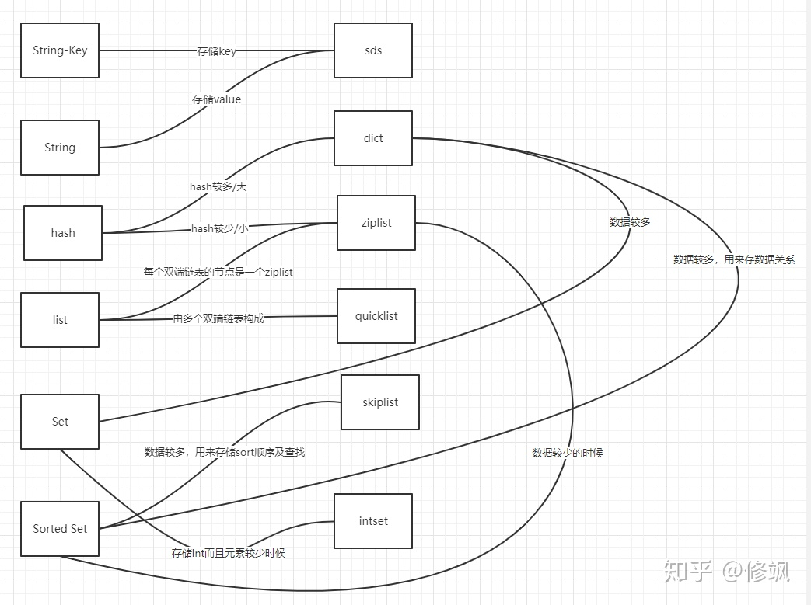

# 缓存

## 缓存问题

### 缓存穿透

- What

  查询缓存和数据库中都没有的数据

  查询数据库中一定不存在的数据，这样每次都会绕过缓存直接打到数据库

- How

  - 缓存空值，但是需要设置过期时间。

    > 存在问题：内存中会存在大量不存在的key的数据
    
  - 布隆过滤器 BloomFilter

    > 本质上是一种数据结构，概率型数据结构；
  >
    > 组成：由一个**很长的二进制向量**（bit 数组）和**一系列随机映射函数（哈希函数）**，用于把元素的hash 值算得比较均匀。
    >
    > 原理：向布隆过滤器中添加元素 时，会使用多个不同的 hash 函数生成多个哈希值，接着将 哈希值 对 bit 数组的长度 取余，将该值在 位图数组中对应位置置为1。判断元素是否存在时，同样会使用这些 hash 函数生成 哈希值，并对 bit 数组的长度 取余，判断获得的值 在位图数组中的位置是否全部为1，如果全部为1，那么该元素有可能存在过滤器中，如果有一个为0，则可以断定该 元素肯定不存在。
    >
    > 在缓存之前加一层 BloomFilter，记录已有缓存的key，查询的时候先去 BloomFilter 查询，如果不存在就直接返回，存在再接着查询缓存，查询 db.
    >
    > 优点：在时间 和 空间上都有很大优势，没有存储元素本身，存储空间 和插入、查询时间都是 常数时间；
    >
    > 缺点：误算率，随着存入元素数量增加，误算率也会随之增加；位图数组的长度会直接影响误报率，越长，误报率越小；hash函数越多 则数组中为1的速度越快，且效率越低；hash 函数越少，误报率也会越高；不支持删除操作；
    >
    > 补救办法：建立一个小的白名单，存储那些可能被误判的元素。
    >
    > 应用场景：实时消息推送的去重，网页URL的去重，垃圾邮件的判别，集合重复元素的判别

### 缓存击穿

- What

  查询缓存中没有的数据，数据库中有的数据（一般是缓存时间到期）。这时由于并发用户特别多，同时读取缓存读不到，又同时去数据库读，导致数据库压力瞬间增大。

- How

  - 热点数据永不过期
  - 添加互斥锁：第一个查询数据的请求使用互斥锁来锁住，其他线程拿不到锁就一直等待，直到第一个线程查询到数据，设置了缓存，那么后面的线层就会直接走缓存。

### 缓存雪崩

- What

  指缓存中数据大批量到过期时间，而查询数据量巨大，引起数据库压力过大甚至 down 机。和缓存击穿不同的是，缓存击穿指并发查同一条数据，缓存雪崩是指不同数据都过期了

- How

  - 缓存数据的过期时间设置随机
  - 设置多级缓存

## 热点问题

## redis  (Remote Dictionary Server)

redis 是一个开源的，保存在内存中，亦可持久化的 key-value 类型数据结构，可用作数据库，缓存，消息队列。

redis 内置了  副本、 Lua 脚本、 LRU 淘汰策略、事务、不同级别的磁盘持久化，可通过 redis sentinel 和 Redis cluster自动分区来保证高可用。

### 基本数据类型

一个 Redis 节点包含多个 database，而一个 database 维护了从 key object 到 object space 的映射关系，这个映射关系是用一个 dict 来维护的，dict 是一个基于哈希表的算法，使用拉链法解决冲突，增量式重哈希。这个映射关系的 key 是string 类型，实现是 sds，而 value 可以是多种数据类型，比如 string、list、hash 等，通过通用的数据结构 **robj**（redisobject）来表示。robj 包含 5个字段

- type：对象的数据类型，有5种  OBJ_STRING，OBJ_LIST，OBJ_SET，OBJ_ZSET，OBJ_HASH
- encoding：对象内部表示方式（编码）,有10种：OBJ_ENCODING_RAW、INT、HT（hash table，dict实现）、ZIPMAP（不再使用）、LINKEDLIST（不再使用）、ZIPLIST、INTSET、SKIPLIST、EMBSTR、QUICKLIST
- lru：做 LRU 算法用
- refcount：引用计数
- ptr：数据指针

> - String 
>
> 内部结构：根据 encoding 不同，有3种结构：OBJ_ENCODING_INT（表示成数字，实际转为long 型）、或者 OBJ_ENCODING_EMBSTR（特殊的嵌入式的 SDS）、或者OBJ_ENCODING_RAW 原生方式（即Simple Dynamic String（SDS））
>
> 特点：可动态扩展内存；二进制安全；与传统的C语言字符串类型兼容
>
> - list
>
> 内部结构：**ziplist 或者 quicklist**
>
> ziplist 是一个经过特殊编码的双向链表，使用连续的内存空间；3.2 之前
>
> quicklist ：ziplist 的双向链表；3.2+
>
> 应用：消息队列；
>
> - Set	
>
> String 类型的无序集合。集合的成员是唯一的
>
> 内部结构：**hash table 或者  intset**:存储 int 而且元素较少时使用
>
> 应用：求交集、并集等
>
> - Sorted set（zset）
>
> 内部结构：**hash table 、ziplist 或者 skiplist**
>
> String 类型的有序集合，每个元素都会关联一个double类型的分数score。redis正是通过分数来为集合中的成员进行从小到大的排序。有序集合的成员是唯一的,但分数(score)却可以重复
>
> 应用：排名，分数排名
>
> **问题**：score 相同，如何排序
>
> 如果 A 和 B 是两个拥有不同分数的元素，那么如果 A 的分数 大于 B 的分数 则 A 大于 B；
>
> 如果 A 和 B 的分数相同，那么 如果 A 字符串 在 字典上 大于 B 字符串 则 A 大于 B；
>
> 分数相同按照时间排序解决方案：
>
>    分数 score 存入的时候是  double 类型，选择将时间戳放在小数点后
>
> - Hash：value 为 hashmap ,常用于 用户缓存，方便修改
>
> 内部结构：**ziplist  或者 hashtable**
>
> 存储  【对象id  属性 值 】
>
> hset user:001 name bob
>
> hget user:001 name



### Redis 事务

Redis 事务相关命令：

- multi：开启事务
- exec：执行事务中的所有命令
- discard：取消事务，放弃执行事务中的所有命令
- watch：监视一个或多个 key，如果事务在执行前，这个 key（或者多个key）被其他命令修改，则事务被中断，不会执行事务中的任何命令。
- unwatch：取消 watch 对所有 key 的监视

事务处理：

- 编译器错误（语法错误）：语句加入队列时就报错，最终执行事务后，会报错，会全部回滚；
- 运行时错误（Redis 类型错误）：加入队列时正常，执行时某个语句报错，其他语句正常返回ok；不会回滚，

### 高可用

#### Redis Sentinel

Setinel 系统用于管理多个 Redis 服务器，会执行以下三个任务：

- 监控：检查 主服务器 和 从服务器是否正常运行
- 告警：当被监控的某个 Redis 服务器出现问题时，Sentinel 可以通过 Api 向管理员
- 自动故障迁移：当一个主服务器不能正常工作时，Sentinel 会开始一次自动故障迁移操作，它会将失效主服务器的其中一个从服务器升级为新的主服务器，并让失效主服务器的其他从服务器改为复制新的主服务器；当客户端试图连接失效的主服务器时，集群也会向客户端返回新主服务器的地址，使得集群可以使用新主服务器代替失效服务器。

> 主管下线和客观下线

如果一个服务器么有在 master-down-after-milliseconds 选项所指定的时间内，对向它发送 PING 命令的 Sentinel 返回一个有效回复，那么 Sentinel 会将这个服务器标记为主观下线。

服务器对 PING 命令的有效回复可以是以下三种回复的其中一种：

- 返回 +PONG
- 返回 -LOADING 错误
- 返回 -MASTERDOWN 错误

从主观下线切换到客观下线 使用了流言协议：如果 Sentinel 在给定的时间范围内，从其他 Sentinel 那里接受到了足够数量的主服务器下线报告，那么 Sentinel 就会将主服务器的状态从主观下线改变为客观下线，如果之后其他 Sentinel 不再报告主服务器已下线，那么客观下线状态就会被移除。客观下线条件只适用于主服务器。

> 每个 Sentinel 都需要定期执行的任务

1. 每个 Sentinel 以每秒钟一次的频率向它所知的主服务器、从服务器、以及其他 Sentinel 实例 发送一个 PING 命令；
2. 如果一个实例距离最后一次有效回复 PING 命令的时间超过 down-after-milliseconds 选项所指定的值，那么这个实例会被 Sentinel 标记为 主观下线。
3. 如果一个主服务器被标记为主观下线，那么正在监视这个主服务器的所有 Sentinel 要以每秒一次的频率确认主服务器的确进入了主观下线状态。
4. 如果一个主服务器被标记为主观下线，并且有足够数量的 Sentinel(至少要达到配置文件指定的数量)在指定的时间范围内同意这一判断，那么这个主服务器被标记为客观下线。
5. 一般情况下，每个 Sentinel 会以每 10秒一次的频率向它已知的所有主服务器和从服务器发送 INFO 命令。当一个主服务器被 Sentinel 标记为客观下线时，Sentinel 向下线主主服务器的所有从服务器发送 INFO 命令的频率会从 10 秒一次改为每秒一次。
6. 当没有足够数量的 Sentinel 同意主服务器已经下线，主服务器的客观下线状态就会被移除。当主服务器重新向 Sentinel 的 PING命令返回有效回复时，主服务器的客观下线状态就会被移除

> 自动发现 Sentinel 和 从服务器

1. 每个 Sentinel 会以每秒一次的频率，通过发布与订阅功能，向被它监视的所有主服务器和从服务器的 \_\_sentinel\_\_:hello 频道发送一条消息，信息中包含了 Sentinel 的 IP 地址、端口号 和 运行 ID
2. 每个 Sentinel 都 订阅了被它监视的所有主服务器和从服务器的 \_\_sentinel\_\_:hello 频道，查找之前未出现过的 sentinel。当一个 Sentinel 发现新的 Sentinel 时，它会将新的 Sentinel 添加到一个列表中，这个列表保存了 Sentinel 已知的，监视同一个主服务器的所有其他 Sentinel
3. Sentinel 发送的信息中还包括完整的主服务器当前配置（configuration）。 如果一个 Sentinel 包含的主服务器配置比另一个 Sentinel 发送的配置要旧， 那么这个 Sentinel 会立即升级到新配置上。
4. 在将一个新 Sentinel 添加到监视主服务器的列表上面之前， Sentinel 会先检查列表中是否已经包含了和要添加的 Sentinel 拥有相同运行 ID 或者相同地址（包括 IP 地址和端口号）的 Sentinel ， 如果是的话， Sentinel 会先移除列表中已有的那些拥有相同运行 ID 或者相同地址的 Sentinel ， 然后再添加新 Sentinel 。

> 故障转移

一次故障转移由以下步骤组成：

1. 发现主服务器已经进入客观下线状态。
2. 对我们的当前纪元进行自增（详情请参考 Raft leader election ）， 并尝试在这个纪元中当选。
3. 如果当选失败， 那么在设定的故障迁移超时时间的两倍之后， 重新尝试当选。 如果当选成功， 那么执行以下步骤。
4. 选出一个从服务器，并将它升级为主服务器。
5. 向被选中的从服务器发送 `SLAVEOF NO ONE` 命令，让它转变为主服务器。
6. 通过发布与订阅功能， 将更新后的配置传播给所有其他 Sentinel ， 其他 Sentinel 对它们自己的配置进行更新。

Sentinel 自动故障迁移使用 Raft 算法来选举领头 Sentinel，从而确保在一个给定的 epoch 里，只有一个 领头产生

> raft 算法
>
> **leader选举**
>
> raft 使用心跳机制来触发领导者选举。当服务器启动时，所有节点均为 **Follower** 。一段时间内，如果没有收到来自 Leader 的心跳，则从 Follower 切换到 Candidate，发起选举。如果收到 majority 的投票，则当选为 Leader，切换为 Leader 状态。否则切换为 Follower。只要服务器从 Leader 或者 Candidate 接收到有效的 RPC 请求，服务器就会保持 Follower 状态。**Leader** 向所有 Follower 发送定期心跳以保持其权限。如果一个 Follower 在称为选举超时的一段时间内没有 接收到任何通信，该 Follower 认为没有可行的 Leader 并开始选举新的 Leader.
>
> **log replication**
>
> 

#### Cluster 集群

Redis 集群引入了哈希槽的概念，有 16384 个哈希槽，每个 key 通过 CRC16 校验后对 16384 取模来决定放置到哪个槽，集群的每个节点负责一部分 hash 槽。

> Redis 集群的主从复制模式

> Redis 一致性保证

Redis 不能保证数据的强一致性，可能会丢失写操作

1. 集群使用了异步复制
2. 集群出现网络分区，并且一个客户端与至少包括一个主节点在内的少数实例被孤立。

### 单线程为什么这么快

- 纯内存操作
- 单线程操作，避免频繁的上下文切换
- 采用非阻塞 I/O 多路复用机制

### 过期删除策略以及内存淘汰策略

> 过期删除策略：

Redis key 有两种过期方式：被动过期  和 主动过期

被动过期：当某个客户端尝试获取某个 key 时，发现 key 已经超时了，那么这个 key 就会被动过期。缺点：如果已经过期的 key 永远不访问，那么这些 key 会永远停留在内存中，占用内存，无法及时回收。

主动过期：Redis 会定期在具有 expire的 key集合 中随机测试一些 key，对于已过期的 key 会 删除。

Redis 每秒 进行 10 次以下操作：

1. 从 声明可到期的 key 集合中测试20个 随机 key
2. 删除已过期的 key
3. 如果剩余的key 仍然有超过 25% 的 key 已过期，从步骤1重新开始。

> `maxmemory-policy` 设置淘汰策略：

- **noeviction**: 不删除策略, 达到最大内存限制时, 如果需要更多内存, 直接返回错误信息。大多数写命令都会导致占用更多的内存(有极少数会例外。
- **allkeys-lru:**所有key通用; 优先删除最近最少使用(less recently used ,LRU) 的 key。
- **allkeys-random:**所有key通用; 随机删除一部分 key。
- **allkeys-lfu**：所有key通用；使用近似的 LFU 逐出符合条件的 key.Least Frequently Used：最少频率使用；4.0版本支持
- **volatile-random**: 只限于设置了 **expire** 的部分; 随机删除一部分 key。
- **volatile-ttl**: 只限于设置了 **expire** 的部分; 优先删除剩余时间(time to live,TTL) 短的key。
- **volatile-lru:**只限于设置了 **expire** 的部分; 优先删除最近最少使用(less recently used ,LRU) 的 key。最久没有访问的数据最先被淘汰。
- **volatile-lfu**：只限于设置了 **expire** 的部分；优先删除使用频率最少（least frequently used）的 key.4.0版本支持

问题1：使用LRU时，如果短时间内会出现大量只会使用一次的数据，可能导致之前大量高频使用的缓存被删除，请问有什么解决办法?


### 分布式锁

#### 锁特点

- 互斥性
- 可重入性
- 锁超时 ：防止死锁
- 高性能和高可用

#### 实现方式

- 基于数据库：

  > 实现：基于唯一性约束实现； 乐观锁实现
  >
  > 缺点：无锁超时 ， 非重入

- 基于redis

- 基于zookeeper

  > 使用临时顺序节点实现：在创建节点时，Zookeeper根据创建的时间顺序给该节点名称进行编号；当创建节点的客户端与zookeeper断开连接后，临时节点会被删除。

#### redis 实现

##### 使用 set 命令：

   设置 和 过期 为原子操作

```redis
SET key value [EX seconds|PX milliseconds] [NX|XX] [KEEPTTL]
```

参数

- `EX` *seconds* -- 设置过期时间，单位秒 ; since 2.6.12
- `PX` *milliseconds* --设置过期时间，毫秒 ; since 2.6.12
- `NX` -- 当key 不存在时才设置成功; since 2.6.12
- `XX` -- 当key存在时才设置成功; since 2.6.12
- `KEEPTTL` -- Retain the time to live associated with the key；since 6.0

返回值

- 如果执行成功，返回 ok
- 如果实行失败， 返回 Null

eg：设置 一个 key 为 anotherkey，  value 为  will expire in a minute， 过期时间 60s

获取锁：set

```redis
SET anotherkey "will expire in a minute" EX 60
```

释放锁：lua 脚本，需要验证 value

```lua
if redis.call("get",KEYS[1]) == ARGV[1]
then
    return redis.call("del",KEYS[1])
else
    return 0
end
```

```JSON
if redis.call("get",KEYS[1]) == ARGV[1] then return redis.call("del",KEYS[1]) else return 0 end
```

代码实现：

```java
    public boolean lock(Jedis jedis,String key, String value, int timeout, TimeUnit timeUnit) {
        long seconds = timeUnit.toSeconds(timeout);
        return "OK".equals(jedis.set(key, value, "NX", "EX", seconds));
    }

    public boolean unlock(Jedis jedis,String key,String value) {
        String luaScript = "if redis.call('get',KEYS[1]) == ARGV[1] then " +
                "return redis.call('del',KEYS[1]) else return 0 end";
        return jedis.eval(luaScript, Collections.singletonList(key), Collections.singletonList(value)).equals(1L);
    }
```

##### 使用 lua 脚本 ：

   set  和 expire 两条语句，使用 lua 脚本保证原子性

代码实现：

```java
public boolean tryLock_with_lua(String key, String UniqueId, int seconds) {
    String lua_scripts = "if redis.call('setnx',KEYS[1],ARGV[1]) == 1 then" +
            "redis.call('expire',KEYS[1],ARGV[2]) return 1 else return 0 end";
    Object result = jedis.eval(lua_scripts, ImmutableList.of(key), ImmutableList.of(UniqueId, String.valueOf(seconds)));
    //判断是否成功
    return result.equals(1L);
}

    public boolean unlock(Jedis jedis,String key,String value) {
        String luaScript = "if redis.call('get',KEYS[1]) == ARGV[1] then " +
                "return redis.call('del',KEYS[1]) else return 0 end";
        return jedis.eval(luaScript, Collections.singletonList(key), Collections.singletonList(value)).equals(1L);
    }
```

```java
private static final RedisScript<Boolean> newSetIfAbsentScript = new DefaultRedisScript("if 1 == redis.call('setnx',KEYS[1],ARGV[1]) then redis.call('expire',KEYS[1],ARGV[2]) return 1; else return 0; end;", Boolean.class);

    private boolean setIfAbsent(String key, String value, Long seconds) {
        List<String> keys = new ArrayList();
        keys.add(key);
        Object[] args = new Object[]{value, seconds.toString()};
        return (Boolean)this.redisTemplate.execute(newSetIfAbsentScript, keys, args);
    }

    public boolean lock(String key, String value, long timeout) {
        return this.setIfAbsent(key, value, timeout);
    }
```


潜在问题：

实际上在Redis集群的时候也会出现问题，`比如说A客户端在Redis的master节点上拿到了锁，但是这个加锁的key还没有同步到slave节点，master故障，发生故障转移，一个slave节点升级为master节点，B客户端也可以获取同个key的锁，但客户端A也已经拿到锁了，这就导致多个客户端都拿到锁`。

##### Redlock算法 与 Redisson 实现

### 持久化方式

1. RDB 持久化：redis database

   > RDB 是一个非常紧凑（compact）的文件，它保存了 Redis 在某个时间点上的数据集
   >
   > 特点：
   >
   > RDB模式定期将内存中的数据持久化.如果用户允许丢失少量的数据则首选RDB模式,因为RDB模式定期为内存做快照,该方式的备份的速度很快.
   >
   > save 900 1 在15分钟内,如果用户执行了一次set操作则持久化一次
   > save 300 10 在5分钟内,如果用户执行了10次set操作则持久化一次
   > save 60 10000 在1分钟内,如果用户执行了10000set操作则持久化一次

2. AOF 持久化：append of file

   > 把写操作指令，持续的写到一个类似日志文件里(appendonly.aof)
   >
   > #appendfsync always 每次操作都会备份
   > #appendfsync no 关闭AOF模式
   > #appendfsync everysec 每秒备份一次
   >
   > 特点：
   >
   > 1.可以实时数据备份，安全性更好
   > 2.持久化速度较RDB模式慢
   > 3.AOF持久化文件的体积会很大
   > 4.恢复数据时会将日志中记录的所有操作都执行一遍，因此速度会很慢
   > 5.持久化文件明文保存，没有加密

